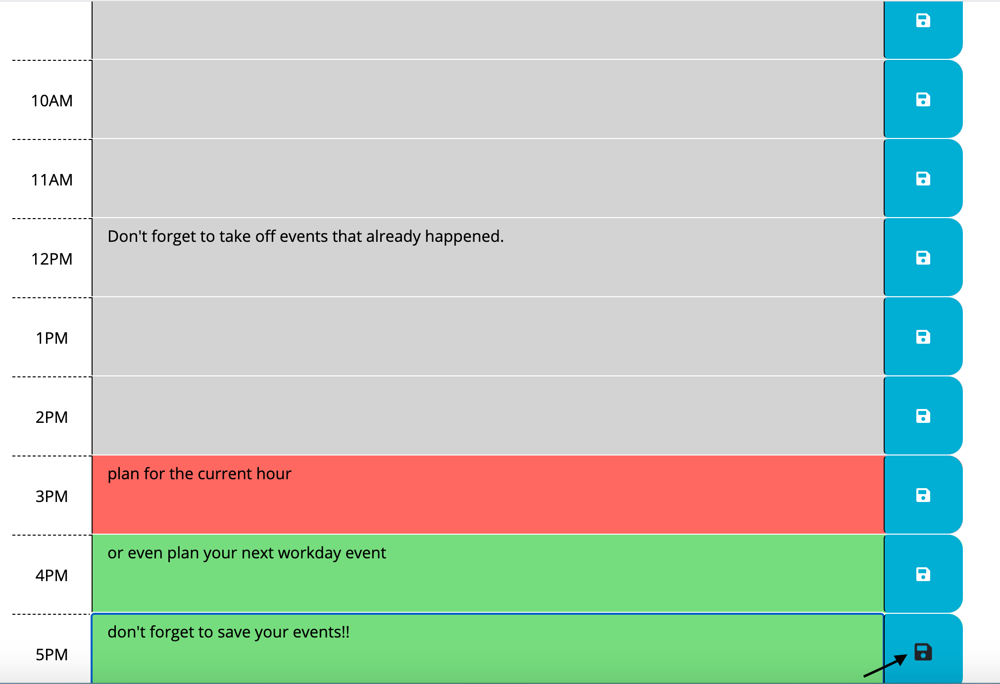

# Your New Workday Planner

## Ditch Your Old Planner:

With so many of the tools we use migrating to online platforms, I think it's time your planner did the same. As a working professional, you're on the go and need a scheduler that you can access no matter where you are. This Workday Scheduler is perfect for you to plan the average work shift hour by hour. Don't forget to save your content using the blue save icon at the end of each content box. This way you can pull up your planner on any device and see the plans you made for yourself for each hour of the day.

## Installation

Using the Workday Scheduler is so easy! Just [click here]() to start planning your day. If you would like to 

https://www.youtube.com/watch?v=n80RRNS1k64

https://momentjs.com/

https://support.google.com/webdesigner/thread/71102880?hl=en

## Active Learning And Using My Resources

This week I reached out to a friend who helped me re-evaluate my study skills. He himself had gone through a bootcamp and had some pointers to revamp the way I was approaching this class. I think the biggest mistake I was making was treating the bootcamp like a semester in college. In college I studied more advanced versions of courses I had been exposed to since high school. So if I encountered a topic I didn't understand, I could spend much more time trying to familiarize myself with it because I understood everything else.

When you're learning a subject that is completely new to you, you simply can't stop learning when you don't understand something. 

As I rewatched the lectures for this unit to refresh my mind prior to beginning the homework, my teacher gave the exact same advice before lecture. Because of the pace at which the program moves, if you stop to parse out every little thing you don't understand, you will fall behind. There just isn't enough time to learn everything. This shouldn't, however, be confused with neglecting the things you can't make sense of.
Now, whenever I come across something I don't understand, I make a note of it, continue through the lecture and either slack my tutor or ask a TA or my instructor during office hours or class, respectively. While GoogleFu is very helpful, you can only get so far. And in some cases, you may not get far at all if you have no idea what to Google. But when I ask my  teachers, they show me how to Google, which resources to look at, etc, until I find the piece that's keeping me from understanding.
And this process repeats until I get to the point where I feel comfortable enough to do these things first, and then ask for help when I don't know how else to move forward.
Another great tactic I found was utilizing my classmates to explain concepts to me when I couldn't understand the terms my teacher was using. I also began to speak up in group work to make sure I was understanding new material being covered. Sometimes I think I have a good grasp of the material, but then when I am asked to guide a group activity, I see that there are still gaps in my understanding. I would rather catch these gaps and fill them during group work then when I am alone and working on homework.

Another piece of advice I was given was to make sure to utilize my resources. For instance, my tutor, my teachers, my TAs, documentation outside of class (e.g. Google), and my mentors. In high school, I did an accelerated program meant to help students get prepared for college. In my classes, I was taught that asking for help was bad because I would be cheating myself out of the learning process. If I wasn't struggling, I wasn't learning, and I would crumble when the difficulty of the information grew.
This couldn't be further from the truth. I met with my tutor after I began working on my homework and he helped me restructure my code in a way that would be less confusing to me so I could get through my if/else statements when writing the code that changes the styling for the timeblocks. 
I'm sure had I kept looking at it, I would have eventually gotten the code to work, but it wouldn't have been with best practices and I probably would not have finished my code before the deadline. Not to mention, if I were to stop looking at my code and come back to it a week later, I wouldn't even be able to read my code because it was so clunky and messy. Which violates the first rule of coding: leave your code cleaner than you found it. Had I not reached out for help, I would be submitting another incomplete assignment. Not to mention, I would feel behind because I missed out on another opportunity to have my understanding of the unit's material critiqued.  
Lastly, finding my own documentation proved to also be a great piece of advice. I found some amazing resources that have paragraphs dedicated to why each step is taken when doing things like creating functions and objects, etc. While the documentation we are given in class can be helpful, I find it to be a bit confusing because the examples are too complex for a complete beginner. Most of the time, I rely on the documentation I find because it's on a level I can understand. 
